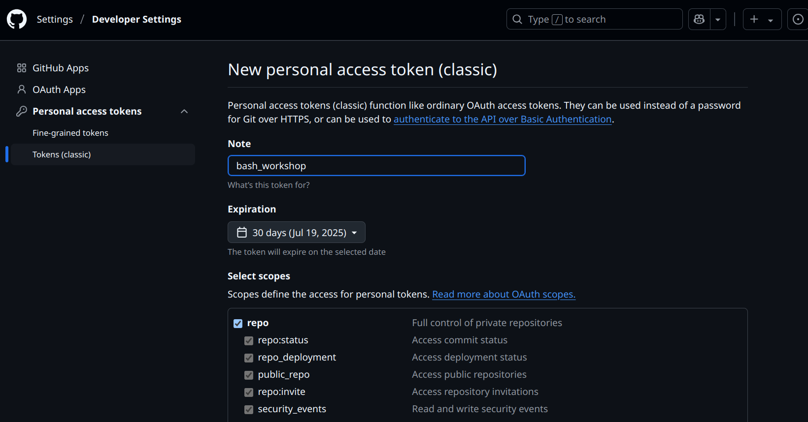

# Context

This repository contains two tasks for the introduction course on Shell and Bash for the Sequencing Techonologies course of the Master in Bioinformatica & Data Science of the University of Siena.

## Prerequisites

- A working installation of git (this will be already present in the server in use).
- Setup your name and your email
  ```
  git config --global user.name "FIRST_NAME LAST_NAME"
  git config --global user.email "MY_NAME@example.com"
  ``` 
- A Personal Access Token created from the [token page](https://github.com/settings/tokens). When you'll do the push, the command line will ask you to enter your GitHub username and password (it'll ask for the password, but you have to enter the token string, which starts with `ghp_`). 

>**NOTE**: place your github token in a safe place.   

To create the token, generate a classical-token


Then it'll ask you to choose the set of permissions required. Just place the tick on `repo` like in the image and then create the token.



**NOTE**: you'll be able to see the token content just one time! So be sure to place it in a safe and accessible place!